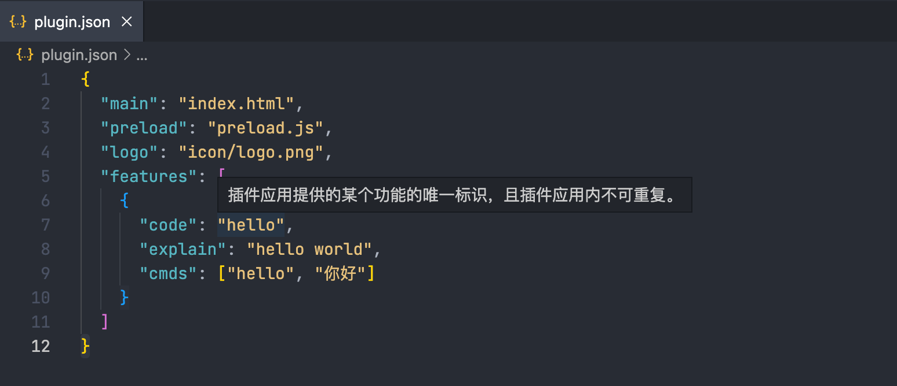
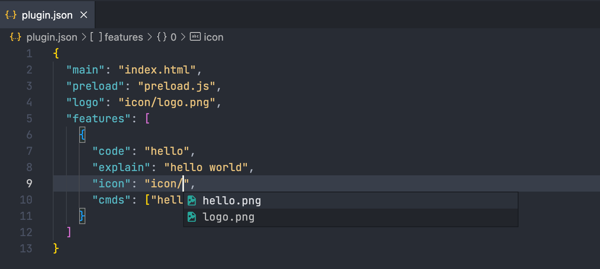

# uTools

用于 uTools 插件开发的 VS Code 扩展。

## 安装

从 VS Code 扩展商店安装。

## 特性

- 支持 `plugin.json` 文件的各个配置项提示和补全
  
  

- 支持 `plugin.json` 文件的 `main`、`preload`、`logo`、`icon` 自动补全路径和转到定义

  

- 状态栏显示 `uTools Plugin`，点击后可跳转到插件配置文件
- 快速创建插件配置文件
- 提供插件配置文件的代码片段

## 更改日志

更改日志查看[这里](CHANGELOG.md)
